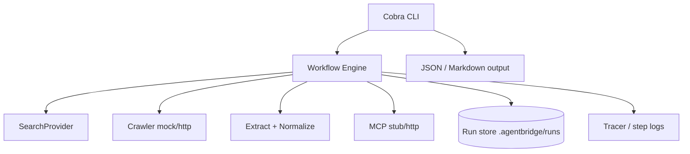

# AgentBridge

[](https://github.com/ofirbts/agentbridge/actions/workflows/ci.yml)
[](https://github.com/ofirbts/agentbridge/releases)
[](https://go.dev/)
[](LICENSE)

**Reliable web execution for AI agents — in Go, as a CLI.**

AgentBridge is a thin layer between your agent logic and the web: retries, structured runs, deterministic mode, and pluggable providers. Not a framework. Not a scraper. An **execution reliability** tool.

---

## Problem

AI agents break on real web work: rate limits, blocked pages, flaky HTML, non-deterministic tools. Frameworks focus on prompts and tools; they under-invest in **durable execution**.

AgentBridge owns the web step: search → crawl → extract → normalize, with observability you can inspect after the fact.

---

## Demo (30 seconds)

```bash
git clone https://github.com/ofirbts/agentbridge
cd agentbridge
make build
./agentbridge run "find top AI infra startups" --mode deterministic
```

Example output:

```json
{
  "status": "success",
  "run_id": "run_det_a95533ac",
  "crawler": "mock",
  "steps": ["search", "crawl", "extract", "normalize"],
  "retries": 0,
  "duration_ms": 0,
  "result": {
    "query": "find top AI infra startups",
    "url": "https://example.com",
    "hits": 2,
    "normalized": { "text": "AgentBridge mock page", "word_count": 3 }
  }
}
```

Inspect the same run:

```bash
./agentbridge inspect run_det_a95533ac --format markdown
```

```
# Run run_det_a95533ac

- Status: success
- Crawler: mock
- Duration: 0ms
- Retries: 0

## Steps

- search
- crawl
- extract
- normalize
```

---

## Quick start

| Requirement | Version |
|-------------|---------|
| Go | 1.23+ |

```bash
make build
make test
./agentbridge --help
```

Common commands:

```bash
./agentbridge run "your task" --mode deterministic
./agentbridge run "your task" --crawler http
./agentbridge explain --task "your task"
./agentbridge simulate-failure --seed 42 --count 3
```

---

## Architecture



| Layer | Role |
|-------|------|
| **CLI** | `run`, `explain`, `inspect`, `simulate-failure` |
| **Engine** | Orchestration, retries, deterministic mode |
| **Providers** | Swappable search / crawl / MCP |
| **Run store** | Persist runs for `inspect` across invocations |

---

## Commands

| Command | Purpose |
|---------|---------|
| `run` | Execute search → crawl → extract → normalize |
| `explain` | Show planned steps and providers (no execution) |
| `inspect` | Load a stored run by `run_id` |
| `simulate-failure` | Test retry behavior with injected failures |

### `run` flags

| Flag | Default | Description |
|------|---------|-------------|
| `--mode` | `normal` | `normal` or `deterministic` |
| `--search` | `mock` | `mock` or `http` (DuckDuckGo API; forced to `mock` in deterministic mode) |
| `--crawler` | `mock` | `mock` or `http` |
| `--mcp-endpoint` | — | MCP server URL (optional) |
| `--mcp-transport` | auto | `http` or `stub` |
| `--store` | `.agentbridge/runs` | Run persistence directory |
| `--format` | `json` | `json` or `markdown` |

---

## Design decisions

1. **Execution over abstraction** — predictable pipelines, not agent personas.
2. **Observability first** — every run gets an ID and stored record.
3. **Failure is default** — retries and simulation are first-class.
4. **Mocks before integrations** — fast CI, clear contracts; swap providers later.

Details: [docs/DECISION.md](docs/DECISION.md) · [docs/RULES.md](docs/RULES.md) · [docs/INFRA-NOTES.md](docs/INFRA-NOTES.md) · [docs/use-cases.md](docs/use-cases.md)

---

## Examples

| Script | What it shows |
|--------|----------------|
| `examples/ai_infra_search.sh` | HTTP crawl + explain |
| `examples/rag_task.sh` | Deterministic run + inspect |
| `examples/simulate_then_fix.sh` | Failure simulation |
| `examples/search_http.sh` | HTTP search provider |

Use cases: [docs/use-cases.md](docs/use-cases.md)

HTTP crawl against a real URL:

```bash
./agentbridge run "task" --crawler http
```

MCP (offline stub):

```bash
./agentbridge run "task" --mcp-endpoint http://localhost:8080/mcp --mcp-transport stub
```

---

## Roadmap

| Version | Focus |
|---------|--------|
| v0.1.0 | CLI, mocks, HTTP crawler, MCP HTTP, docs |
| **v0.2.0** | Search HTTP, observability, benchmarks, OSS packaging (current) |
| v1.x | OpenTelemetry export, plugin registry |

See [CHANGELOG.md](CHANGELOG.md).

---

## Development

```bash
make build
make test
make e2e
make lint
make benchmark
make race
```

Performance notes: [PERFORMANCE.md](PERFORMANCE.md)

Contributions: [CONTRIBUTING.md](CONTRIBUTING.md)

---

## License

MIT — see [LICENSE](LICENSE).
